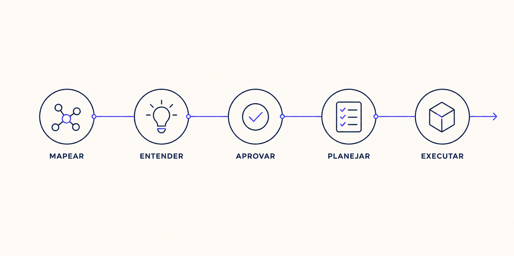

# Brain Flows

Um fluxo de trabalho para transformar mudanças de software em um processo claro, documentado e fácil de retomar.

O Brain Flows ajuda o agente a entender o projeto antes de alterar código, registrar como cada funcionalidade funciona, validar a solução com você, criar um plano e executar uma etapa por vez.



## Por que usar?

Em mudanças maiores, é comum começar a implementar cedo demais e descobrir depois que uma regra, dependência ou arquivo importante foi ignorado. O Brain Flows reduz esse risco ao manter contexto e progresso em documentos versionados junto com o código.

Na prática, ele ajuda a:

- entender um projeto sem reler todo o código a cada tarefa;
- documentar o caminho completo de uma funcionalidade;
- discutir e aprovar a solução antes da implementação;
- dividir a mudança em passos pequenos e verificáveis;
- retomar um trabalho pelo último passo concluído;
- manter a documentação alinhada ao código.

## Como o fluxo funciona

O processo possui uma preparação inicial e um ciclo usado em cada mudança.

### 1. Conhecer o projeto com `flow-init`

Use uma vez ao começar a trabalhar em um projeto que ainda não possui flows.

O `flow-init` analisa a estrutura real do repositório e cria `docs/flow/project-structure.md` com a stack, arquitetura, módulos, features e configurações encontradas. Ele também pode gerar flows individuais ou uma lista de sugestões para documentar depois.

```text
Use flow-init para mapear este projeto.
```

### 2. Mapear funcionalidades com `flow`

Um flow é uma fotografia de como uma funcionalidade funciona de ponta a ponta.

A skill `flow` segue o caminho real no código — por exemplo, da tela para o estado, domínio, repositório, API ou banco — e registra em `docs/flow/<nome>.md`:

- a ordem de execução;
- os arquivos e responsabilidades envolvidos;
- as regras de negócio;
- os caminhos alternativos e erros existentes;
- as dependências externas relevantes.

```text
Mapeie o flow de login deste projeto.
```

### 3. Entender a mudança com `brainstorming`

Antes de implementar uma mudança criativa ou estrutural, o `brainstorming` esclarece o objetivo, lê os flows relacionados e compara as soluções possíveis.

O resultado é uma proposta de design explicada de forma objetiva. A implementação só avança depois da sua aprovação.

```text
Use brainstorming para explorar a criação do login social.
```

### 4. Criar o plano com `writing-plan`

Depois que o design é aprovado, o `writing-plan` transforma a proposta em um arquivo executável dentro de `docs/plan/`.

O plano registra:

- objetivo e contexto;
- arquivos que serão alterados;
- fases e checkboxes;
- verificações e critérios de sucesso;
- riscos e estratégia de rollback;
- flows que precisarão ser atualizados.

```text
Crie um plano para implementar o design aprovado.
```

### 5. Executar com `executing-plan`

O `executing-plan` revisa o plano contra o estado atual do repositório e executa uma tarefa por vez.

Cada checkbox só é marcado depois da verificação correspondente. Se o trabalho for interrompido, a execução pode continuar pelo primeiro item pendente. Ao final, os flows afetados são atualizados quando a estrutura ou o comportamento documentado mudou.

```text
Execute o plano de login social.
```

## Visão resumida

```text
Preparação do projeto
flow-init ──> project-structure.md ──> flows das funcionalidades

Ciclo de uma mudança
brainstorming ──> aprovação ──> writing-plan ──> executing-plan ──> flow atualizado
```

Os arquivos Markdown são a memória compartilhada do processo:

```text
docs/
├── flow/
│   ├── project-structure.md
│   └── login.md
└── plan/
    └── login-social.md
```

## Qual skill devo usar?

| Quando você precisa... | Use |
|---|---|
| Mapear o projeto inteiro pela primeira vez | `flow-init` |
| Entender ou documentar uma funcionalidade existente | `flow` |
| Explorar uma mudança e decidir como implementá-la | `brainstorming` |
| Transformar um design aprovado em passos executáveis | `writing-plan` |
| Implementar ou retomar um plano existente | `executing-plan` |

Você não precisa executar todas as skills em toda tarefa. Uma correção mecânica pequena pode ser feita diretamente; uma feature maior se beneficia do ciclo completo.

## Instalação no Claude Code

```text
/plugin marketplace add andrelucassvt/brain-flows
/plugin install brain-flows@anl-skills
/reload-plugins
```

Invoque as skills com `/brain-flows:brainstorming`, `/brain-flows:flow`, `/brain-flows:flow-init`, `/brain-flows:writing-plan` ou `/brain-flows:executing-plan`.

## Instalação no Codex

```bash
codex plugin marketplace add andrelucassvt/brain-flows
```

No Codex CLI ou IDE, digite `$` para selecionar uma skill ou mencione seu nome explicitamente no prompt. No aplicativo, abra o diretório de Plugins, selecione **ANL Skills** e instale **Brain Flows**.

## Desenvolvimento e empacotamento

O repositório-fonte padrão é `https://github.com/andrelucassvt/brain-flows`, na branch `main`. A sincronização lê as skills em `plugins/brain-flows/skills/` e copia somente as cinco skills do Brain Flows para `.claude/skills/`, `.agents/skills/` e `.github/skills/`.

```bash
./sync-brain.sh
```

Para usar outra origem ou branch sem editar o script:

```bash
SOURCE_REPO=https://github.com/organizacao/repositorio.git SOURCE_BRANCH=develop SOURCE_SKILLS_PATH=plugins/brain-flows/skills ./sync-brain.sh
```

Para recriar `plugins/brain-flows/skills/` a partir de `.claude/skills/`, execute:

```bash
./package-brain.sh
```

Antes de uma release, mantenha a mesma versão nos dois arquivos `plugin.json`, execute os validadores das plataformas e registre a mudança no `CHANGELOG.md`.

### Validação local

Claude Code:

```bash
claude plugin validate .
claude plugin validate ./plugins/brain-flows
```

Codex:

```bash
codex plugin marketplace add "$PWD"
codex plugin marketplace list
```

## Suporte e políticas

- [Suporte](SUPPORT.md)
- [Política de privacidade](PRIVACY.md)
- [Termos de uso](TERMS.md)
- [Licença MIT](LICENSE)
